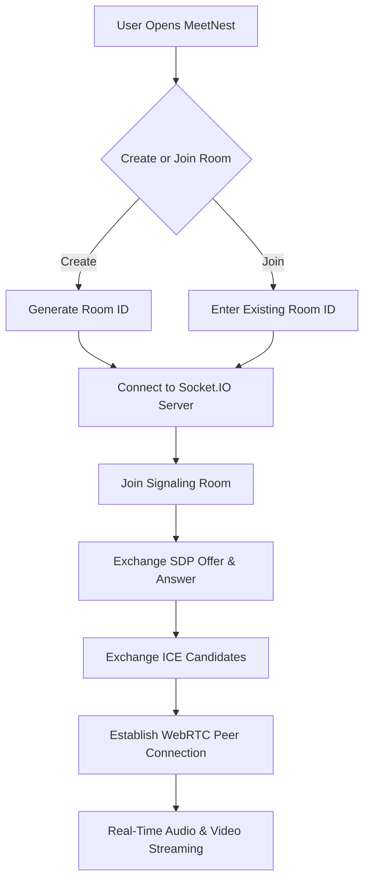
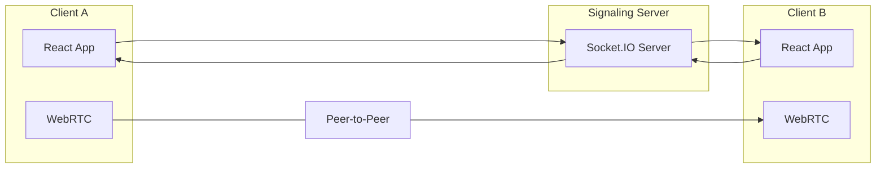

#  MeetNest

A real-time video conferencing application built using **React**, **WebRTC**, and **Socket.IO**, enabling seamless peer-to-peer audio and video communication. MeetNest allows users to create or join meeting rooms instantly using a unique room ID while maintaining low-latency communication through direct browser-to-browser connections.


---

## ✨ Features

- 🎥 Real-time video and audio communication
- 🔗 Create and join meeting rooms using unique Room IDs
- 🤝 Peer-to-peer communication using WebRTC
- ⚡ Low-latency media streaming
- 📡 Socket.IO based signaling server
- 🔄 Automatic WebRTC offer/answer negotiation
- 🌍 ICE Candidate exchange for NAT traversal
- 📱 Responsive user interface
- 🎯 Clean and intuitive meeting experience

---

## 🛠️ Tech Stack

### Frontend
- React.js
- HTML5
- CSS3
- JavaScript

### Backend
- Node.js
- Express.js
- Socket.IO

### Real-Time Communication
- WebRTC
- STUN Servers

---

# 📈 Application Workflow



---

# 🏗️ System Architecture



---

## 📁 Project Structure

```
MeetNest/
│
├── backend/
│   ├── controllers/
│   ├── models/
│   ├── routes/
│   ├── middleware/
│   ├── app.js
│   ├── server.js
│   └── package.json
│
├── frontend/
│   ├── public/
│   ├── src/
│   │   ├── contexts/
│   │   ├── pages/
│   │   ├── controllers/      
│   │   ├── App.jsx
│   │   └── main.jsx
│   └── package.json
│
└── README.md
```
